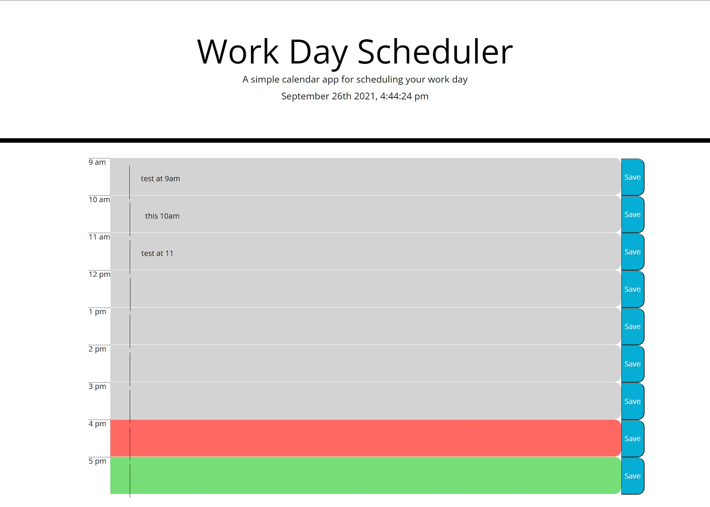

# Scheduler
WHEN open the page 
THEN the current date and time is displayed based on moment.js and displaying the business hour 
WHEN view the blocks
THEN the color of the blocks changed based on the time, it shows past in gray, present in red, and future in green 
WHEN click onto the time slot 
THEN can enter text for schedule 
WHEN click the save button 
THEN it saved in localStorage 
WHEN refresh the page 
THEN the text in localStorage will shows on the page based on time slot 

Deployed webpage: https://junyaq.github.io/bootcamp-challenge-scheduler/
